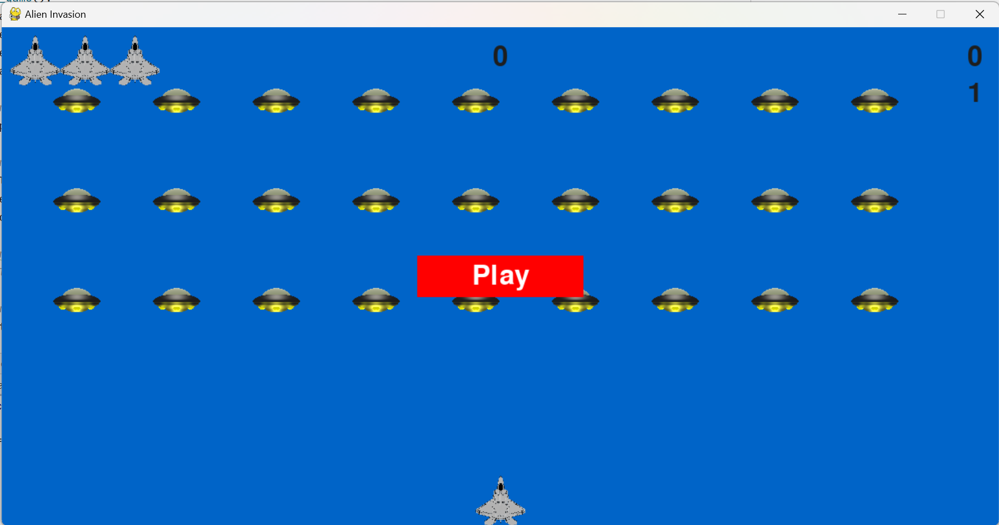
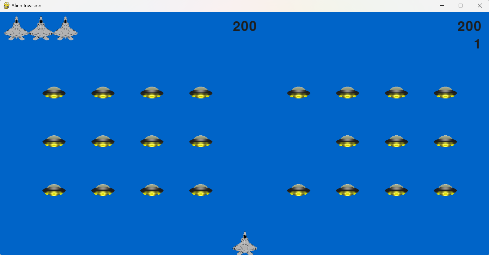

# Space-War-game
This is a flying shooting game where players can control a fighter jet and engage in aerial combat with alien UFO while avoiding their attacks.

# Game Rules
Players need to control the fighter jet to constantly move at the bottom of the screen while using weapons to shoot down enemy planes flying towards them. If the alien UFOs are hit, they will disappear, and the player will earn points. If the alien UFOs fly below the screen, the player's health will decrease. Players need to take down as many alien UFOs as possible and keep their health from being depleted until the game ends.

# Controls
Use the arrow keys on the keyboard to control the fighter jet's movement: move left, move right.
Use the spacebar to shoot.
Players can see their remaining fighters and score at the up of the game screen.

# Notes
- Run alien_invation.py to start the game
- game_function.py is uesed to store basic game settings, such as the rule of scoring, the speed of objects etc.
- scoreboard.py is used to show the scoreboard at the up of the game screen

